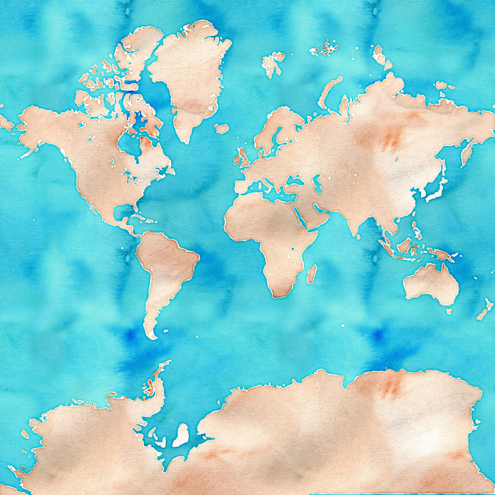

# Watercolor Map Tiles by Stamen Design

This package contains tiles from the Watercolor Map Tiles by Stamen Design set. 



## Usage

The tiles can be used offline, hosted on your own servers, or accessed via the included CDN link for easy integration into web mapping applications.


To install the tiles offline via [NPM](https://www.npmjs.com/package/@freetiler/watercolor), use:
```
npm install @freetiler/watercolor
```

### CDN Links

You can use any NPM or Github CDN to serve the tiles. 

```
GitHub CDNs - Zoom 0-8: 
 - https://cdn.jsdelivr.net/gh/freetiler/watercolor/tiles/{z}/{x}/{y}.jpg
 - https://cdn.statically.io/gh/freetiler/watercolor/main/tiles/{z}/{x}/{y}.jpg
```

## Tile Specs:

- **Minimum Zoom Level**: 0
- **Maximum Zoom Level on NPM**: 7
- **Maximum Zoom Level on Github**: 8
- **Projection Used**: EPSG:3857
- **Tile Size**: 256x256
- **Tile Format**: JPEG
- **Attribution**: "Map tiles by Stamen Design, under CC BY 4.0. Data by OpenStreetMap, under CC BY SA."

## License

Attribution Required: 

FreeTiler.com | Map tiles by Stamen Design, under CC BY 4.0. Data by OpenStreetMap, under CC BY SA.

## Disclaimer

This package is provided "as is", without warranty of any kind. Use at your own risk.
